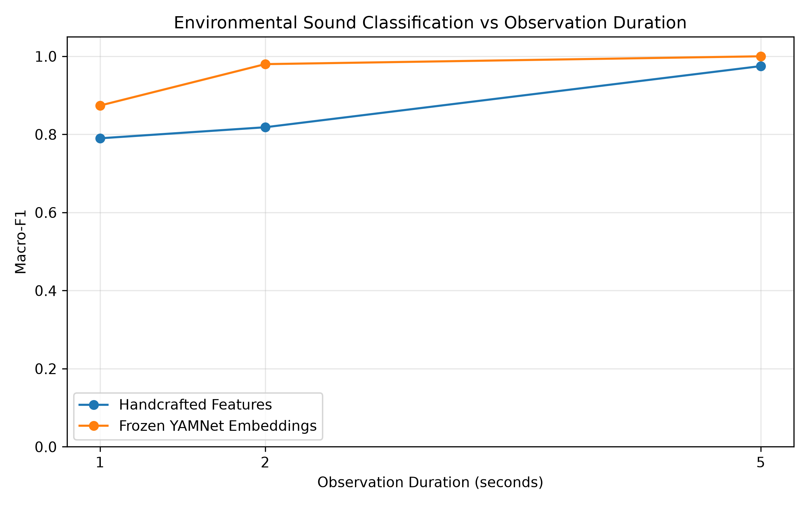
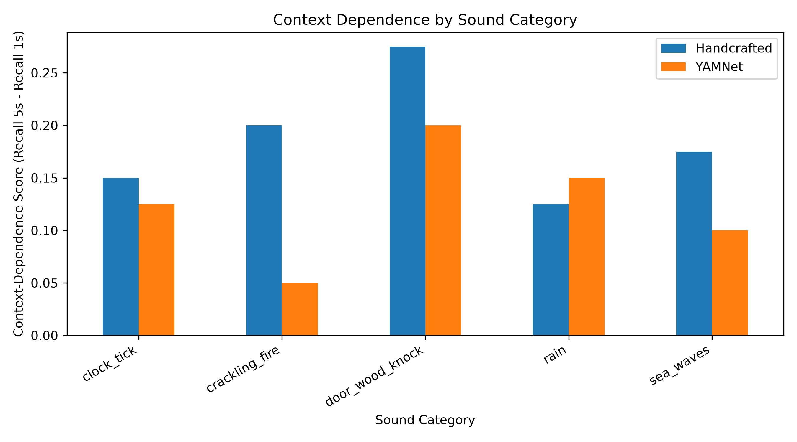

# Environmental Sound Classification with Temporal Context and Audio Representations

## Project Overview

This project explores how the length of an audio clip affects environmental sound classification. It also compares two different ways of representing audio: handcrafted acoustic features and pretrained YAMNet embeddings.

The main research question is:

**How much audio is needed to recognise different environmental sounds, and do handcrafted features and pretrained audio representations respond differently when the available audio becomes shorter?**

## Dataset

This project uses the official **ESC-50** dataset.

- 2,000 audio recordings
- 50 environmental sound classes
- 5 seconds per recording
- Official five-fold cross-validation splits

For the current preliminary experiment, I use five classes and one official test fold to make sure the whole pipeline works correctly before extending the experiment to all 50 classes.

## Method

The experiment compares three observation durations:

- 1 second
- 2 seconds
- 5 seconds

Two audio representations are tested using the same linear SVM classifier.

### Handcrafted acoustic features

The handcrafted feature set includes:

- Zero-Crossing Rate
- RMS energy
- Energy variability
- Spectral Centroid
- Spectral Bandwidth
- Spectral Roll-off
- Spectral Flatness
- Spectral Flux
- MFCCs

### Frozen YAMNet embeddings

YAMNet is used only as a pretrained feature extractor.

- The model is not trained or fine-tuned.
- Each audio observation is converted into a 1024-dimensional embedding.
- The same linear SVM is used for classification.

## Preliminary Results

The current five-class pilot experiment gives the following Macro-F1 scores:

| Observation Duration | Handcrafted Features | YAMNet Embeddings |
|---|---:|---:|
| 1 s | 0.790 | 0.874 |
| 2 s | 0.818 | 0.980 |
| 5 s | 0.975 | 1.000 |

The current results show that both representations benefit from longer audio observations. YAMNet performs better in this pilot experiment, especially when only 1 or 2 seconds of audio are available.

The class-level results also suggest that some sounds, such as `door_wood_knock`, need more temporal context than others.

## Current Analysis

The current evaluation includes:

- Accuracy
- Macro-F1
- Per-class recall
- Confusion matrices
- Context-dependence score
- Energy variability analysis
- Spectral flux analysis

These results are still preliminary because the current experiment only uses five classes and one test fold.

## Resources

- [Official ESC-50 Repository](https://github.com/karolpiczak/ESC-50)
- [Official YAMNet Reference](https://github.com/tensorflow/models/tree/master/research/audioset/yamnet)
- [PyTorch YAMNet Package](https://pypi.org/project/torch-vggish-yamnet/)
- [librosa Documentation](https://librosa.org/doc/latest/index.html)
- [scikit-learn SVM Documentation](https://scikit-learn.org/stable/modules/svm.html)

## Current Status

The preliminary five-class pipeline is complete.

The next step is to extend the experiment to all 50 ESC-50 classes and use the official five-fold cross-validation protocol.